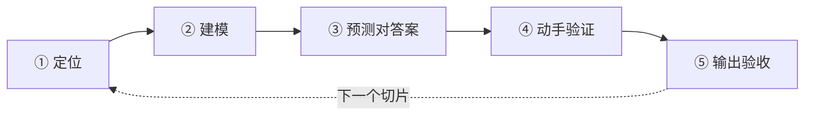

这份笔记解决的是三个具体问题：学习开源项目时进度混乱、不知道学到何种程度算够、学完之后很快忘记。三者的解法分别是固定粒度的学习单元、可检验的行为判据，以及把细节外包给检索的分层记忆。

<Note>
  跑通项目只是 L0 入场券。代码里的设计取舍、抽象层次与性能权衡不会因为多跑几遍而进入理解。
</Note>

## 学习单元：机制切片

学习单位是**机制切片（Mechanism Slice）**，不是一个项目。一个切片是一条完整的、可独立理解的数据或控制流，判断标准是能用一句话说完，并且有明确的输入与输出。

| 项目 | 合适的切片 | 过粗的切法 |
| --- | --- | --- |
| vLLM | 一个请求如何从 `add_request` 走到被调度 | 学习 vLLM 调度器 |
| vLLM | 块表（block table）如何分配与回收 | 学习 PagedAttention |
| vLLM | 前缀缓存（prefix caching）的命中判断 | 学习 KV Cache |
| CUDA Reduce | warp shuffle 规约与共享内存规约的取舍 | 学习 Reduce 算子 |

**同时只允许存在一个进行中的切片。** 想开新的，先把当前切片验收通过，或者写进暂停清单。这一条规则消除了大部分混乱。

## 五阶段流程

每个切片都完整走一遍下面五步，顺序不可跳，尤其是第 ③ 步不能提前到第 ① 步。



以每晚两小时计算，五个阶段合计约六小时，通常跨两到三个晚上完成一个切片。

### ① 定位：链路与文件清单

产出是一份**自己核对过**的文件清单与调用顺序。

1. 让 AI 给出涉及的文件和调用顺序，要求带真实路径与函数名。
2. 用 IDE 的 `Find Usages` 或 `grep` 抽查两到三处，确认路径和函数真实存在。
3. 写下这条链路的第一个函数和最后一个函数。
4. 在头尾两处打断点或加日志，跑一次，确认链路真的被走到。

<Note>
  1 小时内找不到链路，说明切片切大了，回到上一步再切小。
</Note>

验收标准：

- [ ] 能背出这条链路的起止函数和文件名
- [ ] 文件清单自己核对过，没有 AI 编造的路径
- [ ] 断点至少命中过一次

### ② 建模：数据结构与接口

只读数据结构和接口，不读逻辑。产出是核心结构体的字段表与状态转换图。

对每个核心结构体做一张三列表，填不满的字段就是知识空洞，标记出来而不是跳过。

| 字段 | 谁写它 | 谁读它 |
| --- | --- | --- |
| `scheduled_new_reqs` | 调度器分配阶段 | 模型执行器构建 batch |
| `num_scheduled_tokens` | ... | ... |

围绕每个结构体问四类问题：

- **设计意图**：这个字段为什么用引用计数而不是深拷贝？改成深拷贝会有什么后果？
- **反事实**：如果把这个分配策略换成另一种实现，需要改动哪些接口？
- **边界**：这个字段在什么情况下为空？为空时下游哪个分支会挂？
- **失败模式**：什么输入会让这段代码性能崩掉（不是出错，是变慢）？

再让 AI 输出一张 mermaid 状态转换图，描述结构体在生命周期内如何变化，直接贴进笔记。

验收标准：

- [ ] 每个核心结构体的字段表填满，没有「不知道谁写」的字段
- [ ] 能画出状态转换图，不看笔记能复述主干
- [ ] 能用一句话说明这个机制解决什么问题（说不出来说明还停留在细节层）

### ③ 预测对答案

决定成败的一步。**顺序绝对不能反**：先看解释再写理解，写出来的只是复述，会产生「看懂了」的错觉，实际是识别而非回忆。

1. 合上所有窗口，手写一段预测（不看代码）：这个函数做了什么、为什么这么做、关键分支分别在什么条件下走。
2. 把这段话贴给 AI，用下面的模板要求批改。
3. 把批改结果记下来，重写第二版预测。
4. 反复到错误项连续两次为空。

```text
下面是我对 <文件名>:<函数名> 的理解：
<我的原文>

请按以下格式回复，不要复述代码：
1. 我理解错误的地方（引用具体行号）
2. 我漏掉的分支
3. 我没意识到的隐含假设
4. 我理解正确但表述含糊的地方
```

验收标准：

- [ ] 手写预测有文本留存，不是只在脑子里想
- [ ] 第二版预测的错误项不超过 1 条，且是细节而非结构性错误
- [ ] 能说出至少一个自己原本想错的地方

### ④ 动手验证

读代码得到的假设只有改动才能验证。每个实验必须有假设和预期，否则只是瞎试。

| 假设 | 改动 | 预期 | 实际 |
| --- | --- | --- | --- |
| 这个函数每个 step 调用一次 | 加计数器打印 | 输出等于 step 数 | ... |
| 关闭前缀缓存只影响命中率 | 开关设为 `False` | 结果不变，TTFT 变长 | ... |
| 这个分支只在长 prompt 时走 | 打日志加短 prompt | 短 prompt 不打印 | ... |

按性价比排序的实验类型：

1. **加日志或计数器**：最便宜，验证「谁被调用了几次」。
2. **改极端参数**：block size 设成 1 和设成 4096，看行为差异。
3. **注释掉优化分支**：验证这个优化是否真的在起作用。关掉后程序依然正确但变慢，说明理解正确。
4. **性能对比**：Nsight Compute 或 profiler，观察带宽利用率与 occupancy。

验收标准：

- [ ] 至少三个有假设、有预期的实验
- [ ] 至少一个实验结果出乎预期，并且解释了原因（没有意外说明实验太保守）
- [ ] 关掉某个优化前能预测性能变化方向，并验证

### ⑤ 输出验收

产出是一篇自己的笔记，加上一次出题自测。

1. 用自己的话写清：这个机制解决什么问题、怎么做的、踩过哪些坑、在哪想错了。
2. 让 AI 出题，只要题目不要答案。
3. 答完再要答案与评分，答对率低于 80% 则回到第 ③ 步。

```text
针对 <机制名> 出 5 道需要推理的题，不要背诵题，
不要出现「是什么」这类问题。先只给题目。
```

终极验收是对真人（或对着空气）讲 5 分钟，对方能听懂。讲不清就是没懂。

验收标准：

- [ ] 笔记里有「我原本想错的地方」一节，没有这一节说明笔记是抄的
- [ ] 出题答对率不低于 80%
- [ ] 能画一张图，不看笔记讲 5 分钟

## 掌握程度判据

用行为定义程度，替代「感觉懂了」。

| 级别 | 名称 | 可检验的行为 | 能做什么 |
| --- | --- | --- | --- |
| L0 | 跑通 | 程序能跑，报错会查 | 使用这个项目 |
| L1 | 有地图 | 能说出模块划分和一条主链路 | 找到代码在哪 |
| L2 | 懂结构 | 字段表填满，能画状态图 | 读懂别人提的 issue |
| L3 | 能预测 | 给一段代码能预判行为和分支 | 改 bug 不心虚 |
| L4 | 能改动 | 能加功能或换实现，且知道影响面 | 提 PR |
| L5 | 能讲清 | 能给人讲明白，能回答追问 | 写源码解析 |

对「学习一个项目」这个目标，**L3 是及格线，L4 是优秀**。到达 L3 的量化标准是完成三到五个机制切片，每个切片的 ③④⑤ 都通过验收，而不是读完所有文件。

## 学习状态表

放在笔记最上方，一眼看出当前在做什么、卡在哪、哪些可以放。

| 切片 | ①定位 | ②建模 | ③预测 | ④实验 | ⑤输出 | 级别 |
| --- | --- | --- | --- | --- | --- | --- |
| 请求调度链路 | ✅ | ✅ | ✅ | ✅ | ✅ | L3 |
| 块表分配回收 | ✅ | ✅ | 🔄 | ⬜ | ⬜ | L2 |
| 前缀缓存命中 | ✅ | ⬜ | ⬜ | ⬜ | ⬜ | L1 |
| Chunked Prefill | ⬜ | ⬜ | ⬜ | ⬜ | ⬜ | — |

一行里出现两个 🔄 就说明违反了单一切片规则。

## 遗忘的分层处理

遗忘是正常机制，问题不在遗忘本身，而在**忘记之后没有低成本的恢复路径**，于是只能重学一遍。重学才是真正拖慢进度的地方。对策是让该背的极少，其余全部外包给笔记与检索。

### 三层知识的分工

| 层 | 内容 | 处理方式 | 允许忘吗 |
| --- | --- | --- | --- |
| 原则层 | 机制为什么需要、代价是什么 | 间隔检索，进长期记忆 | 不允许 |
| 结构层 | 核心数据结构的字段与关系 | 笔记里的字段表与状态图 | 允许模糊 |
| 细节层 | 函数名、行号、参数默认值、配置项 | `grep` 或笔记检索 | 随便忘 |

区分法则：**换个项目还能用上的属于原则层，只在这个仓库成立的属于细节层。**

- 「分页式管理用间接层消除碎片，代价是每次访问多一次查表」→ 原则层，必须记住
- 「`BlockTable` 里有 `block_table` 和 `num_blocks` 两个字段」→ 结构层，记个大概即可
- 「`gpu_worker.py` 某个函数叫什么」→ 细节层，忘了就 `grep`

把细节层也塞进记忆，是学习效率下降的主要原因。

### 间隔检索排期

重读笔记只产生熟悉感，不产生回忆能力。有效的方式是闭卷默写，排期为 **D0（学完当天）→ D+1 → D+7 → D+30**，每次 5 分钟，只做一件事：

> 拿一张白纸，默写这个机制的**一句话目的 + 主干流程**，不看笔记。

- 默不出来就翻笔记看 5 分钟，这就是真正的复习，不算失败。
- 连续三次默写失败，把该切片降级为「只需要知道它存在」，不要硬背。
- 每次在笔记里记一行：`D+1 ✅ / D+7 ⬜ / D+30 ⬜`。

5 分钟乘以 4 次约 20 分钟，远低于重读一遍源码的代价。

### 机制卡片

在每篇笔记顶部放一张固定格式的卡片，正文则作为查阅资料而非背诵材料。

```markdown
## 机制卡片

- **一句话目的**：用间接层消除 KV Cache 的显存碎片
- **输入 → 输出**：逻辑块号 → 物理块号映射
- **核心权衡**：牺牲一次查表开销，换来近乎零碎片
- **关键结构体**：`BlockTable` 与 `KVCacheBlock` 的引用计数
- **我在哪想错了**：（必填，写不出来说明没真学）
- **复习记录**：D+1 ⬜ / D+7 ⬜ / D+30 ⬜
```

设计完成后，忘记的代价从「等于没学」降到「翻一页笔记」。

### 复习问题的形式

问题形式决定记忆质量。推理型问题答对一次，抵得上背诵型问题答对十次，因为它挂在因果链上。

| 背诵型 | 推理型 |
| --- | --- |
| block size 是多少？ | block 变大 4 倍，碎片和内部浪费分别怎么变？ |
| 用了什么数据结构？ | 为什么用引用计数而不是深拷贝？深拷贝的代价具体在哪？ |
| 这个函数做什么？ | 什么输入会让这个函数变慢 10 倍（不是出错）？ |

### 遗忘日志

每次想不起某个东西时当场记一行，用真实使用频率替代主观重要程度。

```text
日期 | 忘了什么 | 当时想干什么 | 从哪找回来的 | 花了多久
```

一周后回看：反复出现的升到原则层并专门安排复习，只出现一次的保持可查即可。

### 跨项目记忆锚

同一机制在不同项目中再遇到一次，记忆强度高于复习多遍。

- 页表加引用计数：操作系统虚拟内存 → vLLM 的 block table → Redis 共享对象
- online softmax：FlashAttention → 流式统计计算
- warp shuffle：CUDA Reduce → 任意并行规约

主动寻找这类对照，写进笔记的「相关笔记」栏，那一栏的价值是记忆锚点而不是导航。

### 每周固定 15 分钟

周日执行，15 分钟封顶：

1. 更新状态表，看哪个切片卡住。
2. 随机抽三张机制卡片，闭卷默写。
3. 过一遍遗忘日志，把高频项排进下周。

复习计划一旦超过 15 分钟，第三周就会被放弃。

## 提问模板

<AccordionGroup>
  <Accordion title="仓库结构">
    ```text
    这个仓库的顶层模块划分是什么？每个模块的职责、被谁调用？
    请按「入口 → 核心抽象 → 后端实现」三层给出文件路径清单。
    ```
  </Accordion>
  <Accordion title="链路切片">
    ```text
    <机制名> 这一条链路涉及哪些文件、按什么顺序读？
    请给出起止函数与每个文件的职责。
    ```
  </Accordion>
  <Accordion title="结构体建模">
    ```text
    <结构体名> 的每个字段分别由谁写入、被谁读取？
    哪些字段可能为空，为空时下游走哪个分支？
    ```
  </Accordion>
  <Accordion title="批改预测">
    ```text
    下面是我对 <文件名>:<函数名> 的理解：
    <我的原文>

    请指出我理解错误的地方（引用行号）、漏掉的分支、没意识到的隐含假设，
    不要复述代码。
    ```
  </Accordion>
</AccordionGroup>

<Warning>
  不要问「请逐行解释这个文件」。那等于换个人念代码，仍然是被动接收信息。问设计意图、反事实、边界和失败模式，这些问题的答案不在代码字面上，需要推理。
</Warning>

## 三条硬规则

1. **一次只学一个机制。** 想做别的就写进暂停清单，不写代码不开窗口。
2. **48 小时降级规则。** 任何一步卡超过 48 小时或累计 3 小时，降低抽象层级，从「调度器怎么工作」降到「这个函数输入输出是什么」。降级不丢人，卡死才丢人。
3. **有产出才算完成。** 每一步必须有文件、文本或命令输出作为证据，没有产出等于没做，不管看了多久。

## 速查卡

```text
切片：<一句话，含输入和输出>
起点函数：            终点函数：
① 定位   → 文件清单（自己核对过）+ 断点命中
② 建模   → 字段表填满 + 状态图 + 一句话目的
③ 预测   → 手写第一版 → AI 批改 → 第二版错误不超过 1 条
④ 实验   → 至少 3 个带假设的实验，至少 1 个意外并解释
⑤ 输出   → 笔记含「我原本想错的」+ 出题答对率不低于 80%

L3 = 能预测 = 及格    L4 = 能改动 = 优秀
同时只有一个进行中的切片
验收：30 秒内说出机制为什么存在，2 分钟内找回任何细节
```

## 相关笔记

<Columns cols={2}>
  <Card title="PagedAttention 与 KV Cache" icon="microchip" href="/notes/vllm/paged-attention">
    可用来练习机制切片拆分的对象：从预填充与解码两阶段拆到块表分配。
  </Card>
  <Card title="Reduce 算子" icon="layer-group" href="/notes/cuda/reduce">
    计划整理的 warp shuffle 与共享内存规约，是并行规约这一机制的两种实现。
  </Card>
</Columns>
